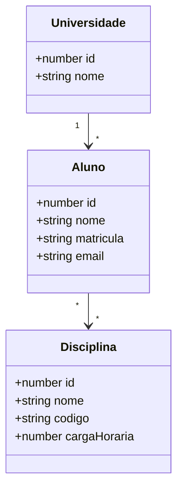

# DOMAIN.md

Este arquivo documenta **somente o domínio variável do projeto atual**.

> Em um novo projeto criado a partir deste template, este arquivo deve ser **gerado ou substituído automaticamente pelo Codex** a partir da descrição textual, diagrama de classes, imagem, PDF ou outro material fornecido pelo usuário.

As decisões arquiteturais, tecnologias e critérios de conclusão estão em `AGENTS.md`.

## Estado deste arquivo

O conteúdo abaixo representa apenas o domínio de referência usado para validar o template.

Ele não é uma entrada obrigatória para novos projetos.

Ao iniciar um novo sistema, o agente deve:

1. interpretar o material fornecido pelo usuário;
2. substituir este conteúdo pelo novo domínio;
3. usar o novo `DOMAIN.md` como fonte da verdade durante a implementação.

## Nome do projeto

Sistema Acadêmico de Referência

## Descrição

Aplicação didática para cadastro de universidades, alunos e disciplinas, incluindo relacionamento 1:N entre Universidade e Aluno e relacionamento N:N entre Aluno e Disciplina.

## Diagrama de classes



## Entidades

### Universidade
- `id`: number, chave primária, gerada automaticamente;
- `nome`: string, obrigatório.

### Aluno
- `id`: number, chave primária, gerada automaticamente;
- `nome`: string, obrigatório;
- `matricula`: string, obrigatório;
- `email`: string, obrigatório.

### Disciplina
- `id`: number, chave primária, gerada automaticamente;
- `nome`: string, obrigatório;
- `codigo`: string, obrigatório;
- `cargaHoraria`: number, obrigatório.

## Relacionamentos

### Universidade 1:N Aluno
- Um aluno pertence a uma universidade.
- Uma universidade pode possuir vários alunos.
- O formulário de aluno deve permitir selecionar a universidade por nome.

### Aluno N:N Disciplina
- Um aluno pode cursar várias disciplinas.
- Uma disciplina pode possuir vários alunos.
- O banco deve possuir tabela associativa.
- O frontend deve permitir associar e desassociar disciplinas de forma simples.

## Regras específicas do domínio

- Toda entidade acima é persistente.
- Toda entidade persistente deve possuir CRUD completo no backend e página CRUD funcional no frontend.
- A matrícula identifica academicamente o aluno e não deve ser vazia.
- O código da disciplina não deve ser vazio.

## Dados iniciais desejados

O `seed.sql` deve criar dados suficientes para validar imediatamente:

- mais de uma universidade;
- mais de um aluno;
- mais de uma disciplina;
- alunos vinculados a universidades;
- pelo menos um aluno vinculado a mais de uma disciplina.

---

## Estrutura esperada quando o Codex gerar um novo domínio

O `DOMAIN.md` resultante deve conter, quando aplicável:

```text
# DOMAIN.md

## Nome do projeto
<nome identificado>

## Descrição
<descrição curta>

## Diagrama de classes
<diagrama fornecido ou representação Mermaid equivalente>

## Entidades
### EntidadeA
- campo: tipo, regras conhecidas

### EntidadeB
- campo: tipo, regras conhecidas

## Relacionamentos
- EntidadeA 1:N EntidadeB
- EntidadeB N:N EntidadeC

## Regras específicas do domínio
- somente regras explícitas ou claramente determinadas pelo material

## Dados iniciais desejados
- dados mínimos suficientes para testar CRUD e relacionamentos
```

Se o material fornecido não definir uma regra de negócio, o agente não deve inventá-la apenas para completar este arquivo.
