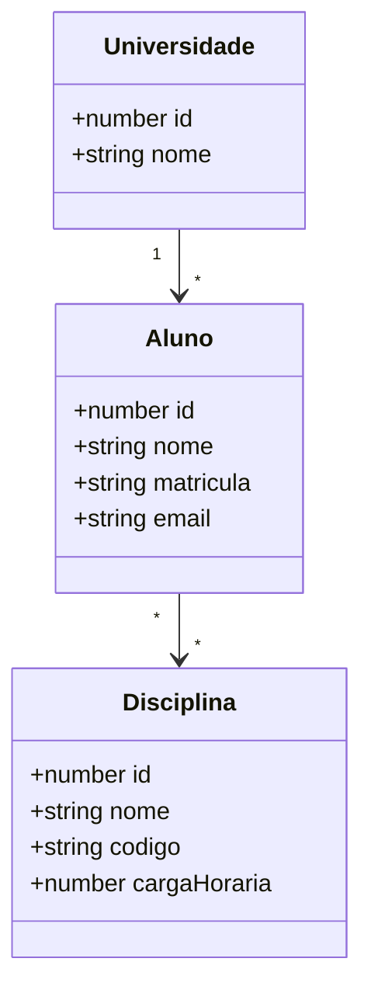

# DOMAIN.md

Este arquivo descreve **somente o domínio variável** do projeto atual.

As decisões arquiteturais, tecnologias e critérios de conclusão estão em `AGENTS.md` e não devem ser repetidos ou alterados aqui.

Para criar um novo projeto a partir deste template, substitua o conteúdo das seções de domínio abaixo e mantenha a estrutura do arquivo.

## Nome do projeto

Sistema Acadêmico de Referência

## Descrição

Aplicação didática para cadastro de universidades, alunos e disciplinas, incluindo relacionamento 1:N entre Universidade e Aluno e relacionamento N:N entre Aluno e Disciplina.

## Diagrama de classes



## Entidades

### Universidade

Atributos:

- `id`: number, chave primária, gerada automaticamente;
- `nome`: string, obrigatório.

### Aluno

Atributos:

- `id`: number, chave primária, gerada automaticamente;
- `nome`: string, obrigatório;
- `matricula`: string, obrigatório;
- `email`: string, obrigatório.

### Disciplina

Atributos:

- `id`: number, chave primária, gerada automaticamente;
- `nome`: string, obrigatório;
- `codigo`: string, obrigatório;
- `cargaHoraria`: number, obrigatório.

## Relacionamentos

### Universidade 1:N Aluno

- Um aluno pertence a uma universidade.
- Uma universidade pode possuir vários alunos.
- O formulário de aluno deve permitir selecionar a universidade por nome.

### Aluno N:N Disciplina

- Um aluno pode cursar várias disciplinas.
- Uma disciplina pode possuir vários alunos.
- O banco deve possuir tabela associativa.
- O frontend deve permitir associar e desassociar disciplinas de forma simples.

## Regras específicas do domínio

- Toda entidade acima é persistente.
- Toda entidade persistente deve possuir CRUD completo no backend e página CRUD funcional no frontend.
- A matrícula identifica academicamente o aluno e não deve ser vazia.
- O código da disciplina não deve ser vazio.

## Dados iniciais desejados

O `seed.sql` deve criar dados suficientes para validar imediatamente:

- mais de uma universidade;
- mais de um aluno;
- mais de uma disciplina;
- alunos vinculados a universidades;
- pelo menos um aluno vinculado a mais de uma disciplina.

---

# Modelo para novos domínios

Ao reutilizar este template, substitua as seções acima usando esta estrutura mínima:

```text
# DOMAIN.md

## Nome do projeto
<nome>

## Descrição
<descrição curta>

## Diagrama de classes
<Mermaid, PlantUML convertido para texto compreensível, ou descrição estrutural>

## Entidades
### EntidadeA
- campo: tipo, regras

### EntidadeB
- campo: tipo, regras

## Relacionamentos
- EntidadeA 1:N EntidadeB
- EntidadeB N:N EntidadeC

## Regras específicas do domínio
- regras de negócio realmente necessárias

## Dados iniciais desejados
- dados mínimos para testar CRUD e relacionamentos
```

Se o diagrama for suficiente para inferir atributos e relacionamentos, não é obrigatório repetir tudo em texto. Porém, qualquer regra que não esteja expressa claramente no diagrama deve ser registrada neste arquivo.
