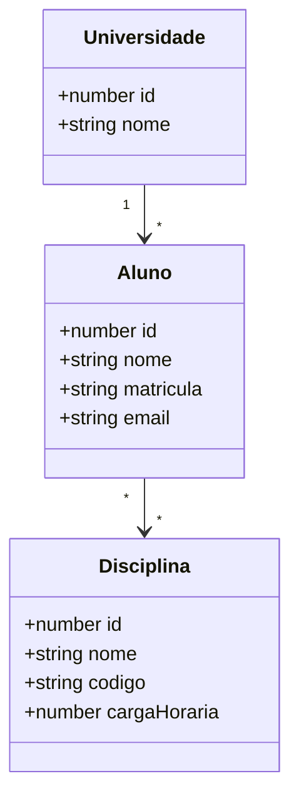

# Domínio de referência

Este domínio existe para validar o template antes da criação das instruções definitivas de geração.

## Regras

- Um aluno pertence a uma universidade.
- Uma universidade pode possuir vários alunos.
- Um aluno pode cursar várias disciplinas.
- Uma disciplina pode possuir vários alunos.
- Toda entidade persistente deve possuir CRUD funcional no backend e uma página CRUD funcional no frontend.
